# Resume Scanner / CVScout

## 1. Project Title and Definition

### Project Title
Resume Scanner / CVScout

### Project Definition
Resume Scanner is a web-based application that helps users evaluate how well their resume matches a given job description. The system allows a user to upload a resume in PDF, DOCX, or TXT format, extract the text, compare it with the requirements in the job description, and generate a match score along with useful suggestions for improvement.

The project is designed for job seekers, recruiters, and academic project demonstration purposes. It combines frontend, backend, and database components to provide a complete full-stack solution.

---

## 2. Project Group Details

### Group Information
- Project Name: Resume Scanner / CVScout
- Department: Computer Science / Information Technology
- Semester: TBD
- Guide Name: TBD
- Institution: TBD

### Group Members
- Member 1: Name
- Member 2: Name
- Member 3: Name
- Member 4: Name

---

## 3. Milestone – 1

### Review Date
06/07/2026

### Review Type
First Review – Project Progress Presentation

### Submitted Documents
- Project title and definition
- Project group details with group members
- Project synopsis
- Project description
- Module-wise description
- Diagrams as applicable
- Database structure
- File/Folder description

---

## 4. Project Details

### Synopsis
The Resume Scanner system provides an automated way to analyze resumes against job descriptions. It helps users identify missing keywords, calculate match percentage, and receive actionable feedback to improve their resumes. The system also includes user authentication and an admin view for monitoring usage and scan activity.

### Project Description
The application consists of two major parts:
1. Frontend interface for users to upload resumes and view analysis results.
2. Backend API for processing uploaded files, extracting text, comparing it with job requirements, and storing results in a database.

The major features of the system are:
- User registration and login
- Resume upload and parsing
- Resume-to-job-description matching
- Match score generation
- Keyword matching and missing keyword detection
- Suggestions for resume improvement
- Scan history tracking
- Admin dashboard for analytics

---

## 5. Description of Each Module in Detail

### 1. Authentication Module
This module handles user access to the application.

Functions:
- User registration
- User login
- JWT-based authentication
- Admin role management
- Protected routes for authenticated users

Technologies used:
- Express.js
- JSON Web Token
- bcryptjs

### 2. Resume Upload and Parsing Module
This module enables the user to upload a resume file and extract readable content from it.

Supported file formats:
- PDF
- DOCX
- TXT

Functions:
- File upload
- Text extraction using PDF and DOCX parsing libraries
- Validation of file type and size

### 3. Resume Analysis Engine
This is the core logic of the system.

Functions:
- Extract keywords from the job description
- Compare those keywords with the resume text
- Calculate the match percentage
- Identify matching and missing keywords
- Generate improvement suggestions

### 4. Scan History Module
The scan history module stores every resume analysis performed by a user.

Functions:
- Save scan results to the database
- Retrieve previous scans for the logged-in user
- Delete old scan records when needed

### 5. Admin Dashboard Module
This module provides administrative monitoring and overview features.

Functions:
- View registered users
- View total scan activity
- View average match score
- View scan logs

---

## 6. Diagrams

### Flowchart
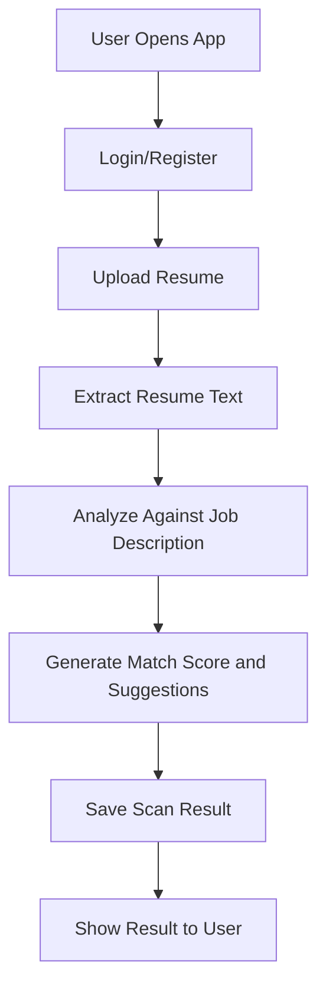

### Data Flow Diagram (DFD)
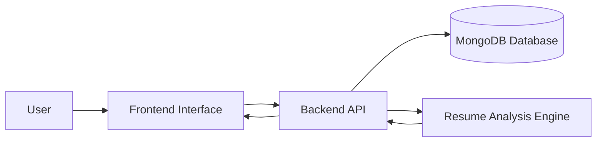

### Use Case Diagram
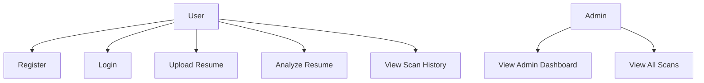

### Sequential Diagram
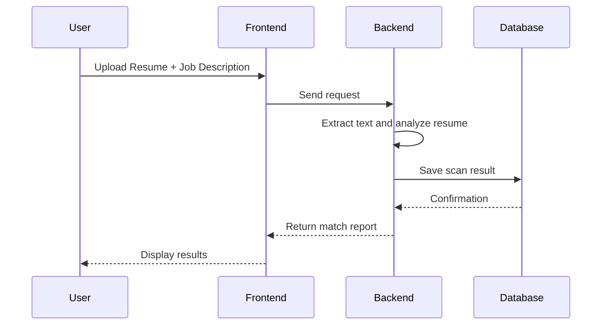

### Class Diagram
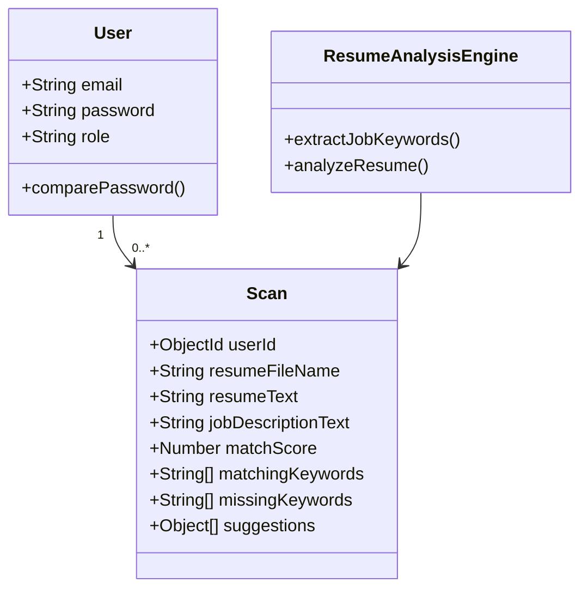

### Activity Diagram
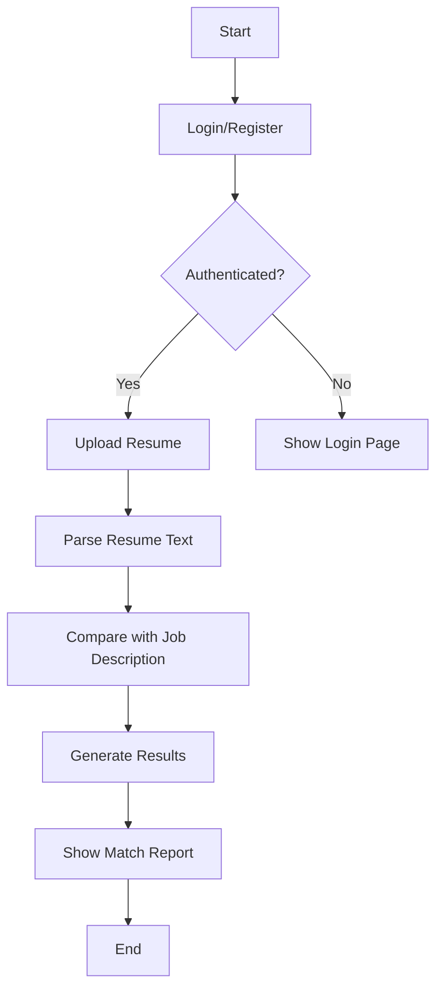

---

## 7. GUI Designs

### Main User Interface Screens
- Login / Registration Page
  - Email and password fields
  - Authentication flow

- Dashboard Page
  - Resume upload section
  - Job description textbox
  - Scan button
  - Scan history list

- Results Page
  - Match percentage
  - Matching keywords
  - Missing keywords
  - Improvement suggestions

- Admin Panel
  - User statistics
  - Total scans
  - Average score
  - Global scan logs

### UI Design Features
- Clean and responsive layout
- Drag-and-drop file upload area
- Visual progress and score indicators
- Simple navigation for users and admins

---

## 8. Database Structure

### Database Used
MongoDB

### Collections / Tables

#### 1. users
Stores user account information.

Fields:
- _id: ObjectId
- email: String
- password: String (hashed)
- role: String (user/admin)
- createdAt: Date

#### 2. scans
Stores every resume scan performed by users.

Fields:
- _id: ObjectId
- userId: ObjectId (reference to users)
- resumeFileName: String
- resumeText: String
- jobDescriptionText: String
- matchScore: Number
- matchingKeywords: Array of Strings
- missingKeywords: Array of Strings
- suggestions: Array of objects
- createdAt: Date

---

## 9. Description of Files / Folders

### Backend
- backend/server.js
  - Main Express server entry point
- backend/routes/auth.js
  - User registration, login, user details, admin user management
- backend/routes/scans.js
  - Resume upload, scan creation, scan history, admin scan retrieval
- backend/models/User.js
  - User schema and password hashing logic
- backend/models/Scan.js
  - Scan schema for storing analysis results
- backend/utils/scannerEngine.js
  - Core resume analysis and keyword extraction logic

### Frontend
- frontend/src/App.jsx
  - Main app component and route logic
- frontend/src/pages/Auth.jsx
  - Login and registration page
- frontend/src/pages/Dashboard.jsx
  - Main dashboard with upload and scan history interface
- frontend/src/components/ScanResult.jsx
  - Scan result display component

---

## 10. Technology Stack

### Frontend
- React.js
- Vite
- CSS
- Lucide Icons

### Backend
- Node.js
- Express.js
- MongoDB
- Mongoose
- JWT
- Multer
- PDF and DOCX parsing libraries

---

## 11. Installation and Run Instructions

### Backend
1. Open the backend folder
2. Install dependencies:
   npm install
3. Start the server:
   npm run dev

### Frontend
1. Open the frontend folder
2. Install dependencies:
   npm install
3. Start the development server:
   npm run dev

### Prerequisites
- Node.js installed
- MongoDB running locally or a valid MongoDB URI configured
- Environment variables for JWT and database connection

---

## 12. Future Scope

- Add AI-based resume scoring
- Support more advanced keyword extraction
- Provide recruiter-style analytics
- Add PDF report download
- Add role-based dashboard improvements
- Integrate with cloud storage

---

## 13. Conclusion

The Resume Scanner project provides an efficient and practical solution for matching resumes with job descriptions. It demonstrates the complete workflow of a web-based full-stack application, from user interaction to data storage and intelligent analysis. The project is suitable for academic submission, project presentation, and future enhancement.

---

# MCA-3 Project Report Documentation

This section follows the MCA-3 Resume Scanning System documentation format and describes the implementation in this repository.

## 14. Project Identification

| Item | Details |
|---|---|
| Project title | Resume Scanning System / CVScout |
| Project type | Web-based full-stack application |
| Academic year | 2026-27 |
| Degree | Master of Computer Applications (MCA) |
| Architecture | MongoDB, Express.js, React, and Node.js |
| Team members | Dishen Gajera, Raj Vadaviya, Parth Ghelani |
| Guide | Dr. Ashwin Dobariya |

## 15. Introduction and Problem Definition

Recruiters and Applicant Tracking Systems compare resumes with job descriptions using skills, keywords, experience, and document structure. Manual comparison is slow and makes it difficult for job seekers to identify missing requirements.

The Resume Scanning System automates this initial evaluation. An authenticated user uploads a PDF, DOCX, or TXT resume and enters a job description. The backend extracts readable text, identifies important job keywords, compares them with the resume, calculates a match score, generates improvement suggestions, and stores the scan report in MongoDB.

## 16. Objectives

- Provide secure user registration and login.
- Accept and validate common resume file formats.
- Extract text from PDF, DOCX, and TXT files.
- Compare resume content with job-description keywords.
- Calculate an ATS-style match percentage.
- Show matching keywords, missing keywords, and recommendations.
- Maintain user scan history.
- Provide authenticated administrative views and bulk scanning support.

## 17. Module Description

### 17.1 Authentication Module
Registers users, hashes passwords through the User model, issues JWT tokens, and protects API routes through authentication middleware. The application also supports an administrator role.

### 17.2 Resume Upload and Parsing Module
Accepts one resume through Multer memory storage. The controller validates the file and extracts text with `pdf-parse`, `mammoth`, or UTF-8 decoding for TXT files. The upload limit is 5 MB.

### 17.3 Job Description Module
Receives the job description as form data with the uploaded resume. The description is used as the source for skill and keyword extraction.

### 17.4 ATS Analysis Module
The scanner engine detects known skills and repeated meaningful terms, compares them with the resume text, and calculates the score as:

`matchScore = round((matchingKeywords / extractedJobKeywords) * 100)`

It also checks contact information, standard resume sections, and approximate document length to produce suggestions.

### 17.5 Scan History Module
Stores each report in the `scans` collection and allows an authenticated user to list, view, and delete their own scans.

### 17.6 Admin and Bulk Scan Module
Provides user statistics, all-scan retrieval for the admin view, and a bulk scan operation that re-evaluates stored resume text against a supplied job description and returns the highest score per user.

## 18. Technical Requirements

### Hardware

- Dual-core processor or better
- Minimum 4 GB RAM
- At least 500 MB free storage
- 1366 x 768 display or better
- Stable internet connection for remote MongoDB use

### Software

- Windows, Linux, or macOS
- Node.js and npm
- MongoDB Community Server or MongoDB Atlas
- Modern browser such as Chrome, Firefox, or Edge
- Visual Studio Code, Git, and Postman for development

## 19. Algorithm

1. Start the application.
2. Register or log in with email and password.
3. Validate the JWT on protected operations.
4. Open the dashboard and select a resume file.
5. Validate that the file is PDF, DOCX, or TXT and does not exceed 5 MB.
6. Extract readable resume text.
7. Receive the job description.
8. Extract known skills and high-frequency meaningful terms.
9. Compare extracted terms with the resume text.
10. Calculate the match score.
11. Detect missing keywords, contact details, sections, and length issues.
12. Store the report in MongoDB.
13. Display the score, keywords, and suggestions.
14. Allow the user to view history, start another scan, or log out.

## 20. System Architecture

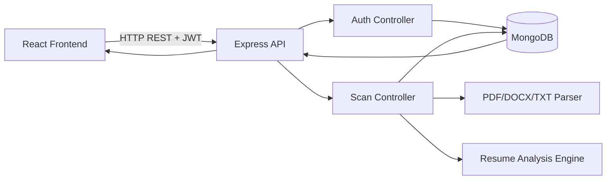

## 21. Flow Chart

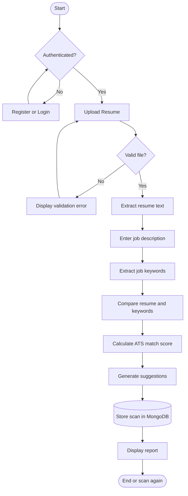

## 22. Data Flow Diagrams

### 22.1 DFD Level 0: Context Diagram

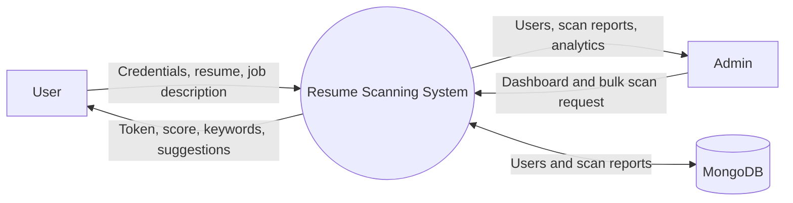

### 22.2 DFD Level 1: Main User Processes

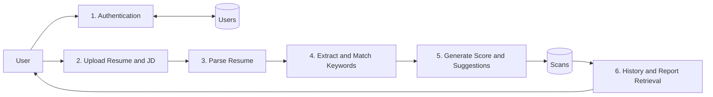

### 22.3 DFD Level 1: Admin Processes

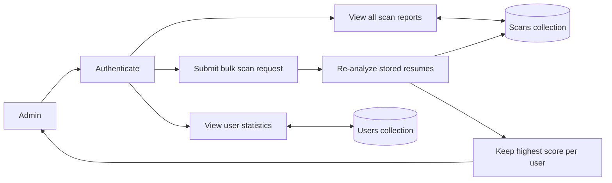

### 22.4 DFD Level 2: Resume Analysis

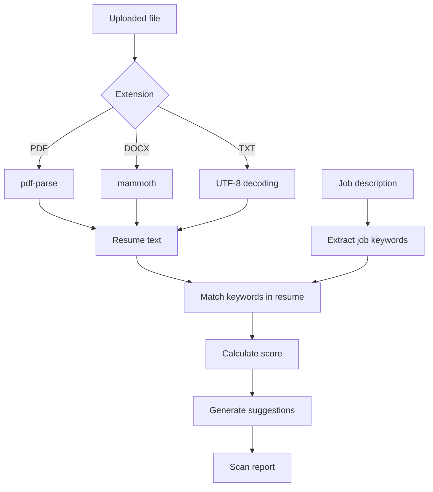

## 23. UML Diagrams

### 23.1 Use Case Diagram

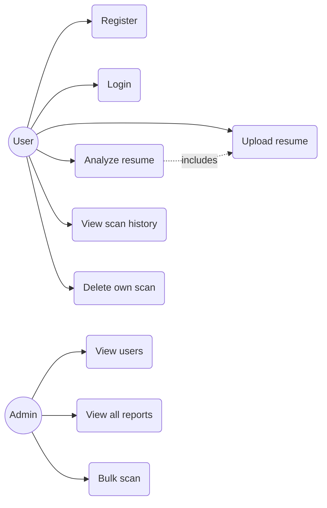

### 23.2 Class Diagram

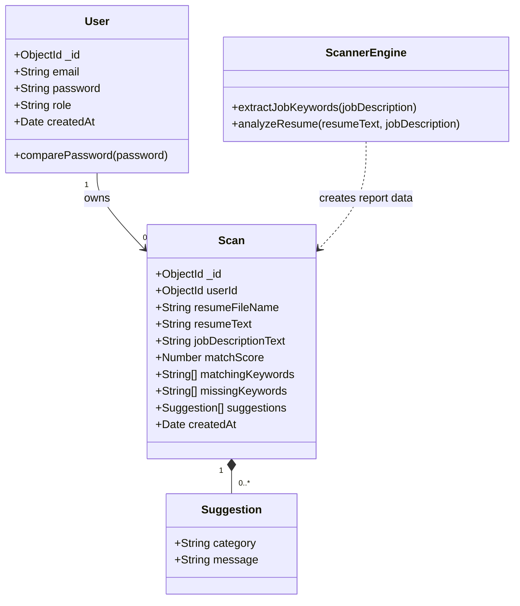

### 23.3 Sequence Diagram

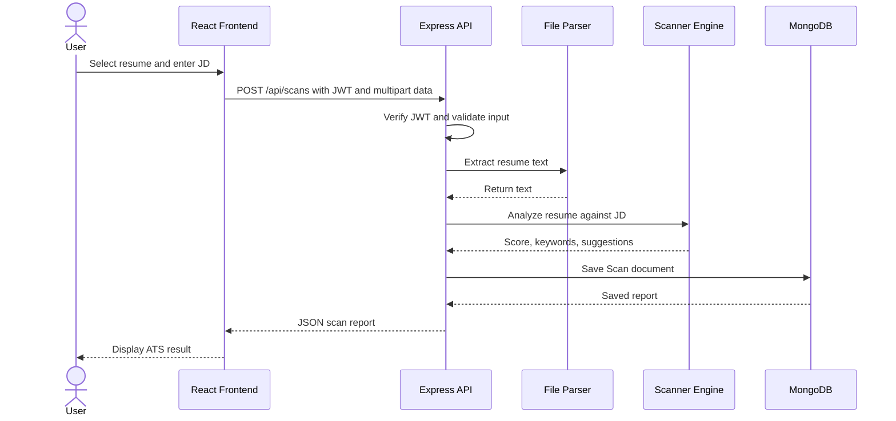

### 23.4 Activity Diagram

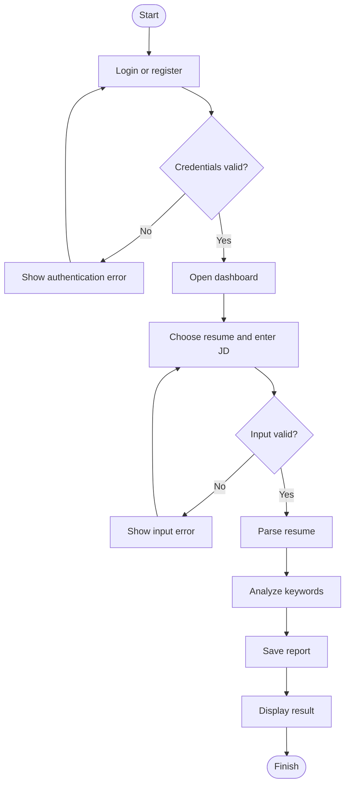

### 23.5 State Diagram

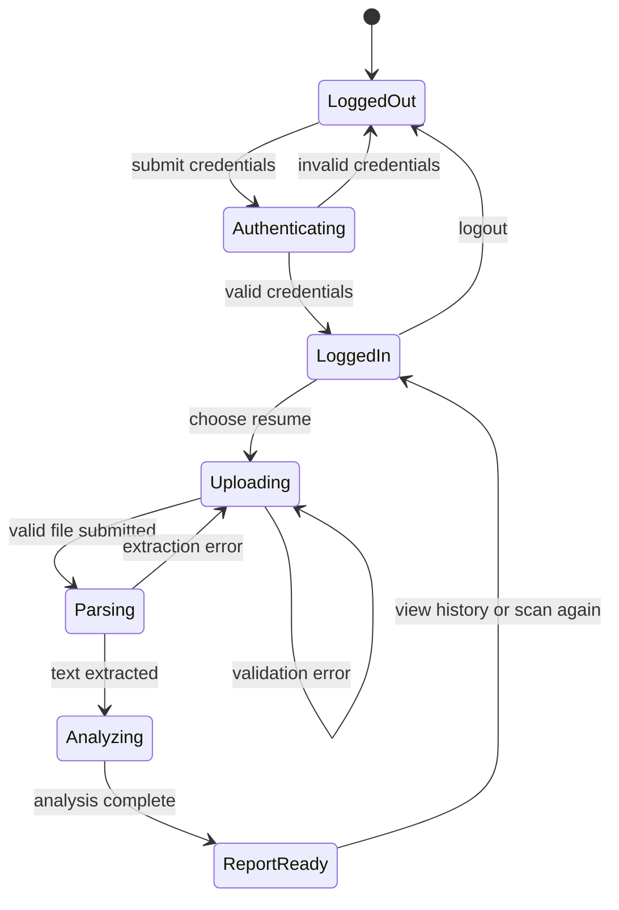

## 24. Database and ER Design

MongoDB stores flexible JSON-like documents. A user can own many scan reports, while each scan belongs to one user through `userId`.

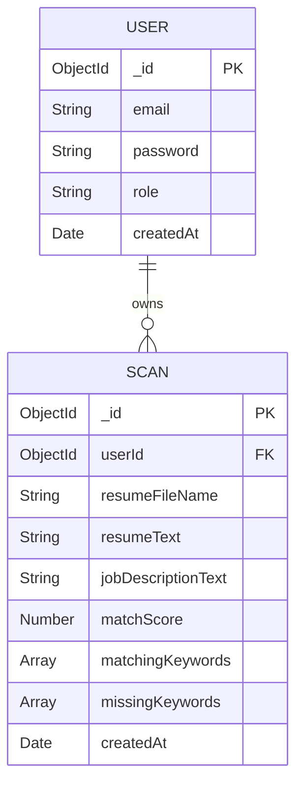

## 25. API Design

| Method | Endpoint | Purpose | Access |
|---|---|---|---|
| POST | `/api/auth/register` | Register a user | Public |
| POST | `/api/auth/login` | Authenticate a user | Public |
| GET | `/api/auth/profile` | Read current profile | JWT |
| GET | `/api/auth/users` | Read users and scan counts | Admin role |
| POST | `/api/scans` | Upload and analyze a resume | JWT |
| GET | `/api/scans` | Get current user's scan history | JWT |
| GET | `/api/scans/:id` | Get one own scan | JWT |
| DELETE | `/api/scans/:id` | Delete one own scan | JWT |
| GET | `/api/scans/admin/all` | Get all scan reports | Admin role |
| POST | `/api/scans/scan-all` | Bulk re-score stored resumes | JWT |

## 26. Menu and Screen Design

### User Menu

- Dashboard / ATS Scanner
- Upload Resume
- Job Description input
- Scan Result
- Scan History
- Logout

### Admin Menu

- Admin Dashboard
- User statistics
- All scan reports
- Bulk scanner
- Logout

### Screens

1. **Authentication screen:** registration and login forms.
2. **Dashboard screen:** upload area, job-description field, scan action, and history.
3. **Result screen:** match gauge, matching keywords, missing keywords, and suggestions.
4. **Admin screen:** users, scan activity, and bulk scan results.

## 27. Test Cases

| ID | Test case | Expected result |
|---|---|---|
| TC-01 | Register with valid email and password | User is created and JWT is returned |
| TC-02 | Register with an existing email | 400 error is returned |
| TC-03 | Login with invalid credentials | Authentication error is displayed |
| TC-04 | Upload an unsupported file | Validation error is returned |
| TC-05 | Upload a file larger than 5 MB | Upload is rejected |
| TC-06 | Scan with empty job description | Request is rejected |
| TC-07 | Scan a readable PDF, DOCX, or TXT file | Report is saved with score and suggestions |
| TC-08 | View scan history | Only the authenticated user's scans are listed |
| TC-09 | Delete an own scan | Scan is removed from history |
| TC-10 | Request admin users as a normal user | 403 access-denied response |
| TC-11 | Run scanner engine unit tests | Keyword extraction and scoring behavior passes |

## 28. Limitations and Future Scope

The current scoring engine is deterministic keyword and structure analysis; it is not a machine-learning model and does not perform OCR on image-only resumes. Future versions can add OCR, semantic similarity, grammar analysis, weighted scoring for experience and education, downloadable PDF reports, cloud file storage, and stricter authorization for bulk scanning.

## 29. MCA-3 Conclusion

The Resume Scanning System demonstrates a complete web application for ATS-oriented resume evaluation. Its modular frontend, REST backend, document parsing, analysis engine, JWT authentication, and MongoDB persistence provide a practical foundation for academic evaluation and future enhancement.
